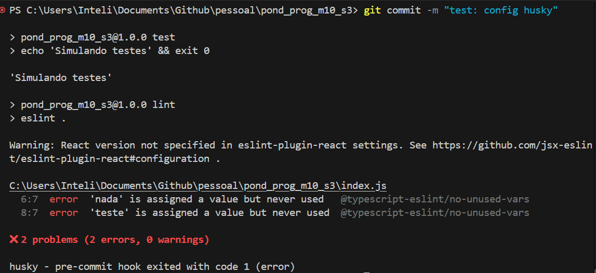
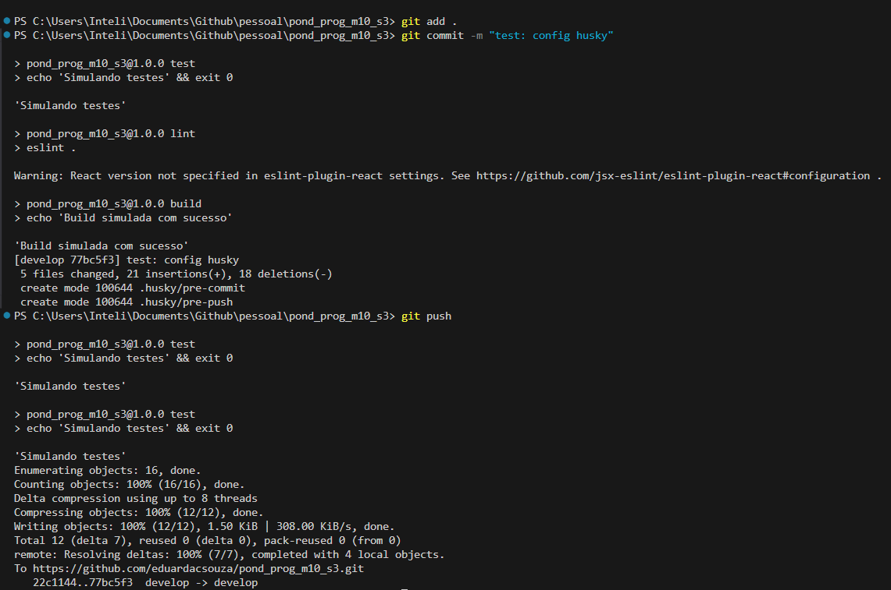

# Relatório de Configuração do Husky

&emsp; Este relatório foi elaborado como parte da atividade prática ponderada da Semana 3 do Módulo 10, com o objetivo de demonstrar a configuração e funcionamento do Husky em um repositório Git. A proposta consiste em integrar hooks de pré-commit e pré-push para garantir que o código só seja enviado ao repositório remoto se estiver devidamente validado por:

- Uma simulação de compilação (npm run build)

- Uma verificação de boas práticas de codificação (npm run lint)

- A execução de testes automatizados (npm test)

&emsp; A seguir, são descritas todas as etapas realizadas no processo, incluindo os comandos executados, scripts configurados e evidências da execução automática dos hooks definidos.

## Objetivo

&emsp; Implementar uma automação com **Husky** em um repositório GitHub, garantindo a qualidade do código por meio de **hooks Git** que executam automaticamente:

- Compilação do projeto (`npm run build`) no **pré-commit**
- Verificação de lint (`npm run lint`) no **pré-commit**
- Execução de testes (`npm test`) no **pré-push**

---

## Tecnologias utilizadas

- Node.js + NPM
- Husky (v9)
- ESLint (v9)
- Jest (simulado)
- Git + GitHub

---

## Etapas realizadas

### 1. Criação do repositório

&emsp; Inicialmente, foi criado um repositório no GitHub e, em seguida, ele foi clonado localmente.

&emsp; O objetivo foi estabelecer a estrutura inicial do projeto e preparar o ambiente para instalação das dependências e configuração do controle de versão.

```bash
git init
npm init -y
```

---

### 2. Instalação e configuração do Husky
&emsp; Para habilitar os hooks Git, o Husky foi instalado como dependência de desenvolvimento. A seguir, o comando husky-init foi executado para criar automaticamente a estrutura de diretórios .husky/ e um hook básico de pré-commit.

&emsp; Essa etapa foi essencial para ativar o suporte ao Husky no repositório e criar a base necessária para utilizar os hooks do Git que automatizam verificações antes de commits e pushes.

```bash
npm install husky --save-dev
npx husky-init && npm install
```

&emsp; Isso criou a pasta `.husky/` com o hook `pre-commit`.

---

### 3. Adição dos hooks

&emsp; Foram adicionados dois hooks com o objetivo de garantir que, antes de cada commit, o código passe pelas etapas de lint e build, e que, antes de cada push, os testes sejam executados, impedindo o envio de código com erros para o repositório remoto.

- **pre-commit**: executa npm run lint e npm run build

- **pre-push**: executa npm test

```bash
npx husky add .husky/pre-commit "npm run lint && npm run build"
npx husky add .husky/pre-push "npm test"
```

---

### 4. Configuração dos scripts no `package.json`
&emsp; Os scripts essenciais foram definidos no package.json. As ações de lint, build e teste foram implementadas de forma simples para simular a automação esperada.

&emsp; Essa etapa visa centralizar e padronizar os comandos que serão executados automaticamente pelos hooks do Husky, facilitando a manutenção e a consistência do processo:

```json
"scripts": {
  "prepare": "husky install",
  "build": "echo \"Build simulada com sucesso\"",
  "lint": "eslint . --config eslint.config.mjs",
  "test": "echo \"Simulando testes\" && exit 0"
}
```

---

### 5. Configuração do ESLint
&emsp;A ferramenta ESLint foi inicializada com suporte ao ambiente de navegador e ao framework React, e configurada para detectar apenas problemas no código.

&emsp; O objetivo dessa etapa é garantir que o código siga boas práticas de desenvolvimento e padrões de estilo, ajudando a identificar erros comuns, trechos mal estruturados ou inconsistências ainda durante o desenvolvimento. Isso contribui diretamente para a legibilidade, manutenção e qualidade geral do projeto.

```bash
npx eslint --init
```

Configuração baseada em:

- Javascript
- ESM
- React
- Browser

Arquivo gerado: `eslint.config.mjs`

---

## Evidências de execução

### Execução do pré-commit
&emsp; Ao tentar realizar um commit com erros de lint no código, o Husky executou o hook de pré-commit e bloqueou o commit conforme o esperado.



---

### Execução do pré-push
&emsp; No momento de realizar um git push, o Husky executou automaticamente o comando npm test, simulando os testes automatizados com sucesso.



---

## Conclusão

&emsp; A configuração do Husky foi concluída com sucesso, garantindo que somente códigos que passam pelas verificações definidas sejam versionados:

- O **lint** e o **build** são verificados automaticamente antes de cada commit.
- Os **testes** são executados antes de qualquer push.
- Commits com erros de lint são corretamente **bloqueados**.